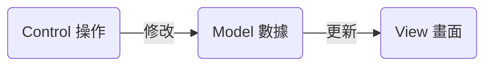
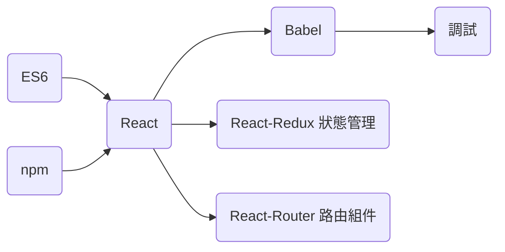

# React 筆記

### React → React + React-Redux + React-Router


###### <br/>

---

###### <br/>


## React 歷史

#### React 的出現是因為 Facebook 對市面上所有 MVC 框架都不滿意，所以自己創立的框架，並成功使用 React 搭建 Instagram。

###### <br/>
###### <br/>
###### <br/>


## React 特點

- **組件式開發**

- **虛擬 DOM**

- **JSX**

- **單向數據流**

###### <br/>
###### <br/>
###### <br/>


## 組件式開發

#### 在構建網站時，將網站的每一部份考慮為一個組件

#### 複用、更新、組合。

###### <br/>
###### <br/>
###### <br/>


## React 的單向數據流綁定



##### 若已 JQuery 為例，假設要做一個按鈕點擊變色，會先設定監聽 onclick (Control)，更改 CSS、HTML (View) 和設定數據判斷是否點擊 (Model)，以上流程 Control 同時動到 View 和 Model

###### <br/>
###### <br/>
###### <br/>


## React 主流開發方式



###### <br/>
###### <br/>
###### <br/>


## 建立 React 專案

1. 全域 npm 安裝 React 構建工具：npm install create-react-app -g

2.  建立 React 專案環境：create-react-app 【專案名稱】

3. 運行 React 專案：npm start

###### <br/>
###### <br/>
###### <br/>


## 初步解讀 CRA 文件和結構

- `node_modules`：組件和依賴項

- `public`：靜態目錄，存放靜態文件，其中 index.html 中有 `<div  id="root"></div>`，此為靜態模板

- `src`：裡面是 React 的源文件，主要編輯文件

- `README.md`：檢視文件，對這個項目的描述以及運行方法等

- `package.json`：項目包的管理文件 (腳手架文件)，對 CRA 文件和結構的說明

###### <br/>
###### <br/>
###### <br/>


## 初步解讀 React 語法和結構

### 1. import ... from ... 關鍵字：引入其他組件 / 資源

#### 類似於 CommandJS 中的 require

- import React, { Component } from "react"; &nbsp;&nbsp;// 引入 React 及其 Component

- import logo from "./logo.svg"; &nbsp;&nbsp;// 引入 React logo (圖像資源)

- import "./App.css"; &nbsp;&nbsp;// 引入 APP.css (css 資源)

###### <br/>

### 2. class 和 extends 關鍵字

####  ES6 中，類和繼承的表達方式

```
// ES5
let Animal = function(height) {
	this.height = height;
}

let Human = function(height) {
	this.height = height;
}

Human.prototype = new Animal();
console.log(new Human(180));

// ES6
class Animal {
	constructor() {
		this.type = "animal";
	}
}

class Human extends Animal {
	constructor(height) {
		super();   // 繼承父類
		this.height = height;
	}
}
```

###### <br/>

### 3. render 函數

#### 用於將 JSX 渲染 DOM 到頁面中

- 在 React 組件 (類) 中是必須要實現的

- render 函數只在 state 改變後觸發

###### <br/>

### 4. export 語法

###### <br/>

### 5. JSX 語法和規則

#### 因為 JSX 是使用 HTML 風格書寫的 JS，需要注意兼容問題

#### 在 JS 的基礎上增加 HTML 的內容變成 JSX，而不是 HTML + JS

###### <br/>
###### <br/>
###### <br/>


## JSX 在 React 中描述 DOM 的方式

#### JSX 不是標準的 JavaScript，但是在 React 中會被 babel 編譯為 JavaScript

```
  React                                                              ES5

   JS
   ↑                                                   const demo = React.createElement(
const demo =                             babel.js         "div",
<div className="react-demo">11</div>    ——————————>       {className: "react-demo"},
   ↓                                                      "11"
  JSX                                                  )
```

###### 以上過程知道就可以了

###### <br/>
###### <br/>
###### <br/>


## JSX 標籤屬性說明

HTML 標籤屬性|JSX|原因  
:-:|:-:|:-:  
for|htmlFor|for 在 JS 中為 for 循環關鍵字
class|className|class 在 JS 中為聲明類關鍵字
style|需使用 JS 對象|

###### <br/>
###### <br/>
###### <br/>


## JSX 中執行 JS 程式碼

#### 一個 {} 只能執行一行 JS 語句 (所以像 for 迴圈等就不行)

```
Example 1：三元運算符
{person/sex ? "男" : "女"}

Example 2：調用某數組的 map 方法或 forEach 方法等等
{
	history.map((v, k) => <p></p>)
}
```

###### <br/>
###### <br/>
###### <br/>


## JSX 中的註解：使用 {}

- HTML 註解：````<!-- 註解 -->````

- JSX 註解：```{/* 註解 */}```

###### <br/>
###### <br/>
###### <br/>


## JSX 中必須只有一個根節點

```
正確：
render() {
	return(
		<div>
			<p></p>
			
		</div>
	)
}


錯誤：以下寫法有兩個根節點
render() {
	return(
		<div>
			
		</div>
		<p></p>
	)
}
```